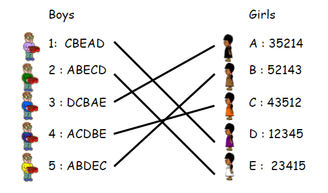

# Life is Optimal for the Proposers

## Stable Marriage Problem Background

- **Background on the Stable Marriage Problem / Algorithm** : https://www.youtube.com/watch?v=Qcv1IqHWAzg 
- **TLDR explanation of problem**: Marriage problem: find a way to pair up two groups of men and women, where each person has a ranked order preference from the other group, and there are no **unstable pairings**. An unstable pairing is a pair that both would prefer to leave their couple to be with eachother.
- **TLDR explanation of algorithm**: One algorithm to solve this problem is Gale-Shapley: on each day, all single men propose to their top choice left, all women pick their favorite currently proposing to them to couple up with, the rest of the men are single that night. Repeat this until everyone is paired. This surprisingly causes optimal pairings for all men (the proposers), and pessimal pairings for all women(the accepters/rejectors) (best and worst possible to be stable). Fun math problems: prove this algorithm 1. creates a stable pairings, 2. is optimal for men, pessimal for women. 

## Application to Life

