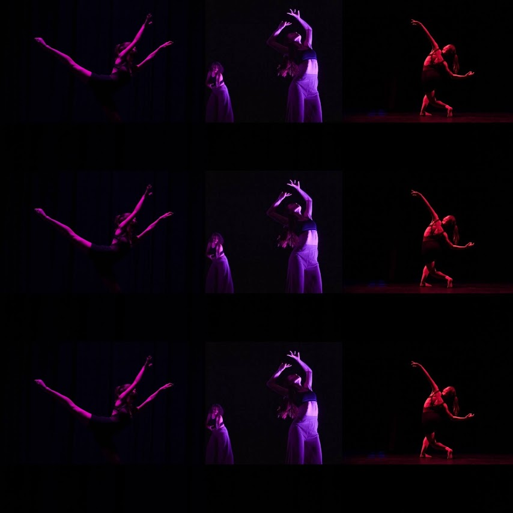

_Last updated: {{ site.time | date: '%Y-%m-%d' }}_

## About Me

AAA HOW DID U FIND THIS WORK IN PROGRESS 

Hi! I’m Julie Steele, a sophomore at MIT studying computer science, artificial intelligence, and econ. My current research interests are in machine learning, probabilistic programming, and program synthesis. I'm most passionate about mitigating risks that will come with AI. I also love math problems, improv comedy, and all sorts of dancing. 

Welcome to my website. Bit of a diary/tracker/public presence, we'll see!

 <!-- Resize to 50% of the container width -->
 <!-- Resize to 50% of the container width -->
